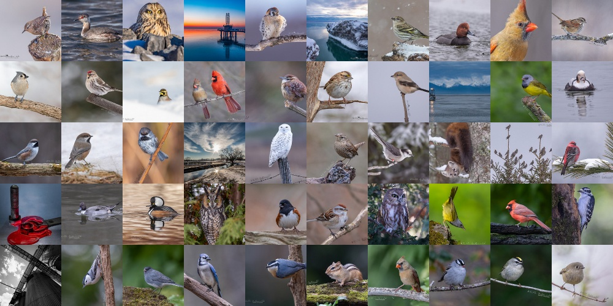

# Flickr.com photo collage maker (public photos only)
## Install
```sh
git clone https://github.com/melehin/photocollage.git
cd photocollage
pip install -r requirements.txt
```

## Usage
```sh
python photocollage.py [-h] --count COUNT [--procs PROCS] --cell_size CELL_SIZE --ratio RATIO [--login LOGIN] [--out OUT]
```

## Example
### Recent photos
```sh
python photocollage.py --count=50 --cell_size=100 --ratio=10x5 --procs=2
```
### by Flickr.com nickname to save to file result-image.jpg
```sh
python photocollage.py --count=50 --cell_size=100 --login=tekfx --ratio=10x5 --procs=2 --out=result-image.jpg
```
